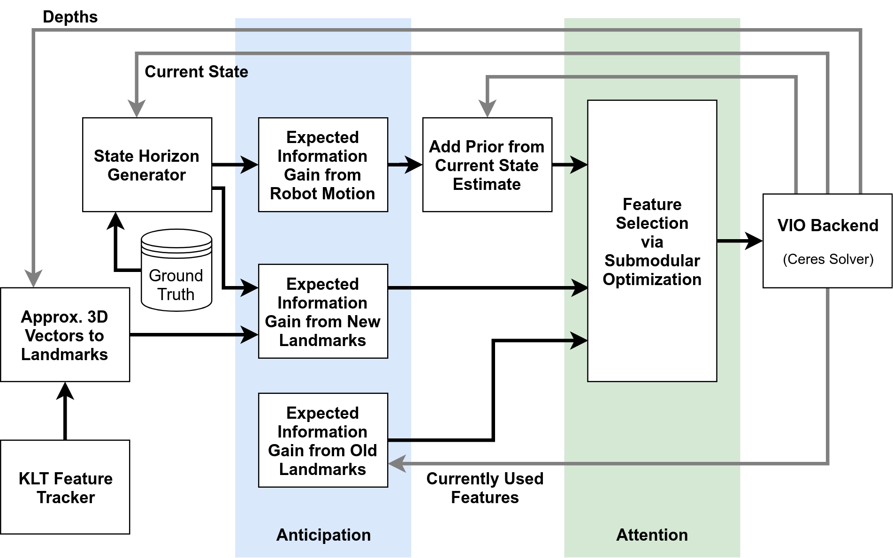

Anticipated VINS-Mono
=====================

During aggressive maneuvers, vision-based perception techniques tend to fail because of the lack of tracked features. The purpose of this work is to mitigate loss of feature tracks by being more clever with which features are selected for use in the optimization. By doing so, we add robustness to the visual-inertial motion estimation because features that are likely to be soon lost based on future motion are not selected. Further, we allow for more efficient optimization by using fewer features with high information content.

## Related Papers
- L. Carlone and S. Karaman, **Attention and Anticipation in Fast Visual-Inertial Navigation**, 2017 IEEE International Conference on Robotics and Automation (ICRA), Singapore, 2017, pp. 3886-3893. [pdf](https://arxiv.org/abs/1610.03344)
- T. Qin, P. Li and S. Shen, **[VINS-Mono](https://github.com/HKUST-Aerial-Robotics/VINS-Mono): A Robust and Versatile Monocular Visual-Inertial State Estimator**, in IEEE Transactions on Robotics, vol. 34, no. 4, pp. 1004-1020, Aug. 2018. [pdf](https://ieeexplore.ieee.org/document/8421746/?arnumber=8421746&source=authoralert)

## Architecture

## Changes in VINS-Mono

The following are new files, implemented as part of the anticipation algorithm.

| File/Component     | Description                                                |
|--------------------|------------------------------------------------------------|
|[feature_tracker][1]| This is our own re-implementation of the VINS-Mono front end using the same processing ideas. Processing time is equivalent, if not 1-2 ms faster. The `feature_img` (`PointCloud`) message has been altered to return feature scores from `cv::goodFeaturesToTrack`. |
|[state_defs.h][2]| Useful `typedef`s for horizon, state, features, and information matrices. |
|[feature_selector.cpp][4]| Implements the expected information calculation (anticipation) and the feature selection algorithm (attention). This is where most of the work is done. |
|[feature_selector.h][3]| Associated header file. |
|[horizon_generator.cpp][6]| Implements the *State Horizon Generator* block. Two methods are implemented for predicting the future horizon: `IMU`, which propagates forward using the latest IMU measurement; and `GT`, which composes the current state estimate with relative ground truth transformations over the horizon. This method is meant to emulate having desired future poses from a path planner or from MPC. |
|[horizon_generator.h][5]| Associated header file. |

[1]: https://github.com/plusk01/Anticipated-VINS-Mono/tree/anticipation/feature_tracker
[2]: https://github.com/plusk01/Anticipated-VINS-Mono/blob/anticipation/vins_estimator/src/utility/state_defs.h
[3]: https://github.com/plusk01/Anticipated-VINS-Mono/blob/anticipation/vins_estimator/src/feature_selector.h
[4]: https://github.com/plusk01/Anticipated-VINS-Mono/blob/anticipation/vins_estimator/src/feature_selector.cpp
[5]: https://github.com/plusk01/Anticipated-VINS-Mono/blob/anticipation/vins_estimator/src/utility/horizon_generator.h
[6]: https://github.com/plusk01/Anticipated-VINS-Mono/blob/anticipation/vins_estimator/src/utility/horizon_generator.cpp

## Authors

- [Parker Lusk](https://github.com/plusk01)
- [Soumya Sudhakar](https://github.com/soumya-ss)

## Licence

[VINS-Mono](https://github.com/HKUST-Aerial-Robotics/VINS-Mono) is released under [GPLv3](http://www.gnu.org/licenses/).
